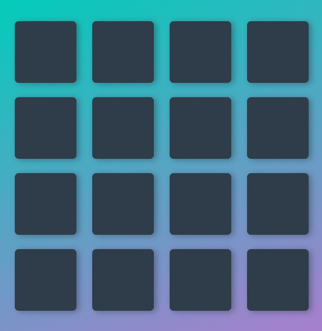

# Memory Game Project

## Udacity

### Front End Web Developer
##### Memory Game

Game:  https://aparnagandhe.github.io/Memory-game-Udacity-nanodegree/

Matching Game! Click the cards to find a match. Match all 16 cards as fast and best as you can!  

A fun game for users to play! Focuses on DOM manipulation, variables and object-oriented programming

